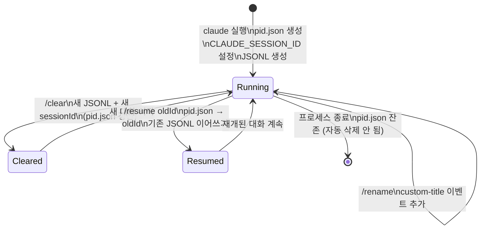

# Claude Code 세션 내부 동작 (Background Knowledge)

> cc-tower 구현과 무관한 Claude Code 자체의 세션 관리 메커니즘을 정리한다.
> 소스: `~/.claude/` 파일 시스템 실측 + 공개된 훅 이벤트 스펙.

---

## 1. 파일 시스템 구조

```
~/.claude/
├── sessions/
│   └── {pid}.json              ← 프로세스별 현재 세션 정보
├── projects/
│   └── {slug}/
│       └── {conversationId}.jsonl  ← 대화 이벤트 로그
├── settings.json               ← 전역 설정 (hooks, permissions 등)
├── settings.local.json         ← 로컬 설정 (gitignore 권장)
├── hooks/                      ← 훅 스크립트
├── todos/                      ← 세션별 TODO 목록
├── history.jsonl               ← 전역 사용 통계
└── CLAUDE.md                   ← 전역 사용자 지시문
```

---

## 2. sessions/{pid}.json

Claude Code 프로세스 하나당 하나의 파일이 생성된다.

```json
{
  "pid": 25142,
  "sessionId": "01d73b84-dac8-4de0-be9b-eb0caefc2ab5",
  "cwd": "/home/kevin.park/workspace/shared-storage",
  "startedAt": 1778827264621
}
```

| 필드 | 설명 |
|------|------|
| `pid` | Claude Code 프로세스 PID |
| `sessionId` | 현재 대화의 UUID. `/clear`, `/resume` 시 변경됨 |
| `cwd` | 프로세스 시작 디렉토리 |
| `startedAt` | Unix timestamp (ms) |

**중요 특성:**
- `/clear` 또는 `/resume` 실행 시 **`sessionId`가 즉시 새 UUID로 갱신**된다.
- 갱신은 **비동기**이므로, 훅 이벤트가 도착하는 시점에 파일이 아직 이전 값을 가리킬 수 있다 (stale window).
- `name` 필드는 **현재 Claude Code 버전에서 기록하지 않는다** (미래 확장 가능성).

---

## 3. projects/{slug}/{conversationId}.jsonl

### slug 계산

```
cwd → '/'를 '-'로 치환 후 leading '-' 추가
예: /home/user/project → -home-user-project
```

### conversationId

- `sessionId`와 **다를 수 있다**. Claude Code가 대화 파일을 생성할 때 별도 UUID를 부여하는 경우가 있음.
- 파일명 = 내부 이벤트의 `sessionId` 필드값 → 두 값이 동일.
- `/clear` 시 새 UUID로 새 파일 생성. 이전 파일은 삭제되지 않고 영구 보존.

### JSONL 이벤트 타입

각 라인은 독립된 JSON 객체다. 주요 타입:

```
type: "user"          — 사용자 메시지 (message.role="user")
type: "assistant"     — Claude 응답 (message.role="assistant")
type: "system"        — 시스템 이벤트 (subtype으로 세분)
type: "custom-title"  — /rename 실행 결과 (customTitle 필드)
type: "agent-name"    — 에이전트 이름 설정
type: "last-prompt"   — 마지막 사용자 프롬프트 캐시
type: "progress"      — 비동기 작업 진행 상황
type: "attachment"    — 파일 첨부
type: "permission-mode" — 권한 모드 변경
type: "file-history-snapshot" — 파일 히스토리
type: "queue-operation"       — 큐 작업
```

#### user / assistant 이벤트 구조

```json
{
  "parentUuid": "이전-메시지-uuid",
  "isSidechain": false,
  "promptId": "턴-uuid",
  "type": "user",
  "message": {
    "role": "user",
    "content": "사용자 입력 텍스트"
  }
}
```

- `parentUuid`: 대화 트리 구조. `null`이면 루트.
- `isSidechain`: `true`면 사이드체인 (서브에이전트 등).
- `promptId`: 하나의 "사용자 → 어시스턴트" 턴을 묶는 UUID.

#### custom-title 이벤트 구조

```json
{
  "type": "custom-title",
  "customTitle": "nss-new-nvme-device",
  "sessionId": "a6215185-b139-438e-b03b-dd399351f2d7"
}
```

- `/rename <name>` 명령어 실행 시 추가됨.
- **같은 파일에 여러 번 등장 가능** (rename을 여러 번 한 경우).
- 최신 것이 현재 이름.

#### system 이벤트 주요 subtype

```
subtype: "local_command"       — /rename, /clear 등 로컬 명령 실행
subtype: "stop_hook_summary"   — stop 훅 실행 결과 요약
subtype: "turn_duration"       — 턴 소요 시간 통계
subtype: "stop_hook_error"     — stop 훅 실패
```

---

## 4. 환경 변수

Claude Code 프로세스는 시작 시 환경 변수를 설정한다:

| 변수명 | 값 | 시점 |
|--------|-----|------|
| `CLAUDE_SESSION_ID` | 현재 conversationId (UUID) | 프로세스 시작 시 설정, JSONL 생성 전부터 유효 |
| `CLAUDE_CODE_ENTRYPOINT` | `"cli"` 또는 `"sdk"` 등 | 시작 방식 구분 |

**`CLAUDE_SESSION_ID`의 특성:**
- `/clear`나 `/resume` 이후에도 **환경 변수는 변경되지 않는다** (프로세스 재시작 없이는 불변).
- `sessions/{pid}.json`의 `sessionId`가 변경돼도 환경 변수는 원래 값을 유지.
- 결과: `CLAUDE_SESSION_ID` = 프로세스 **최초 대화의** conversationId.

---

## 5. 세션 관련 명령어와 파일 시스템 변화

### `/clear` — 대화 초기화

```
사용자: /clear
  ↓
새 conversationId 발급 (새 UUID)
새 JSONL 파일 생성: projects/{slug}/{newConvId}.jsonl (초기 size=0)
sessions/{pid}.json 갱신: sessionId → newConvId
  ↓
기존 JSONL 파일은 삭제하지 않음 (보존)
CLAUDE_SESSION_ID 환경 변수는 변경 없음
```

**결과:** 같은 PID가 두 개의 JSONL 파일을 순차적으로 사용하게 됨.

### `/resume <sessionId>` — 이전 대화 재개

```
사용자: /resume a6215185-...
  ↓
지정한 conversationId의 JSONL 파일 열기
sessions/{pid}.json 갱신: sessionId → 지정한 conversationId
  ↓
CLAUDE_SESSION_ID 환경 변수는 변경 없음
기존 JSONL에 이어서 새 이벤트 append
```

**결과:** JSONL 파일을 다시 열어 이어쓰기. 파일 mtime이 갱신됨.

### `/rename <name>` — 세션 이름 지정

```
사용자: /rename my-session
  ↓
현재 JSONL에 이벤트 추가:
  { "type": "custom-title", "customTitle": "my-session", ... }
  { "type": "agent-name",   "agentName": "my-session",   ... }
  ↓
sessions/{pid}.json에 name 필드 기록 (버전에 따라 다름)
```

**결과:** JSONL 파일 자체에 이름이 기록됨. 파일명은 변경되지 않음.

---

## 6. 훅 시스템 (Hooks)

Claude Code는 특정 이벤트 발생 시 외부 스크립트(훅)를 실행한다.

### 훅 종류

| 훅 | 발생 시점 |
|----|-----------|
| `PreToolUse` | 도구 실행 직전 |
| `PostToolUse` | 도구 실행 직후 |
| `UserPromptSubmit` | 사용자 입력 제출 시 |
| `Notification` | Claude가 알림을 보낼 때 |
| `Stop` | Claude가 응답 완료 후 |

> `SessionStart`는 공식 훅 종류가 아닌 cc-tower 내부 용어일 가능성 있음.
> JSONL의 `progress.hook_progress` 이벤트에서 훅 실행 기록 확인 가능.

### 훅 설정 위치

```json
// ~/.claude/settings.json
{
  "hooks": {
    "Stop": [
      {
        "matcher": "",
        "hooks": [
          {
            "type": "command",
            "command": "~/.claude/hooks/my-stop-hook.sh"
          }
        ]
      }
    ]
  }
}
```

### 훅 환경 변수 (실행 시 제공)

| 변수 | 내용 |
|------|------|
| `CLAUDE_SESSION_ID` | 현재 세션 ID |
| `CLAUDE_CODE_ENTRYPOINT` | 실행 방식 |
| `CLAUDE_TOOL_NAME` | (PreToolUse/PostToolUse) 실행된 도구명 |
| `TMUX_PANE` | tmux 환경이면 pane ID |

---

## 7. 대화 트리 구조 (parentUuid)

JSONL 내 메시지는 단순 순서 배열이 아니라 **트리(DAG)** 구조를 가진다.

```
null (루트)
  └── user-msg-1 (parentUuid: null)
      └── assistant-msg-1 (parentUuid: user-msg-1.uuid)
          └── user-msg-2 (parentUuid: assistant-msg-1.uuid)
              ├── assistant-msg-2a  ← 메인 대화
              └── assistant-msg-2b  ← 사이드체인 (isSidechain: true)
```

- `isSidechain: true` → 서브에이전트, 도구 호출 결과 등 별도 체인
- `/resume` 시 기존 트리에 새 브랜치가 추가됨

---

## 8. 컨텍스트 압축 (Context Compaction)

컨텍스트가 한계에 근접하면 Claude Code가 자동으로 압축을 수행한다.

**파일 시스템 변화:**
- **기존 JSONL 파일에 압축 요약 이벤트가 추가**됨 (파일명 변경 없음)
- `sessionId` 변경 없음 (새 파일 생성 안 함)
- 압축 이벤트는 일반 `system` 타입으로 기록됨

**훅 발생:**
- 압축 자체가 훅을 발생시키지 않음
- 압축 후 사용자 메시지 처리가 재개되면 기존 흐름 계속

**사실상 외부에서 관찰 불가능한 내부 최적화.** 대화 내용은 유지되고 압축된 표현으로 교체됨.

---

## 9. 세션 생명주기 요약



---

## 10. 핵심 설계 제약

| 특성 | 설명 |
|------|------|
| `sessionId ≠ conversationId` 가능 | `sessions/pid.json`의 UUID와 JSONL 파일명이 다를 수 있음 |
| `CLAUDE_SESSION_ID` 불변 | 프로세스 수명 동안 최초 값 유지 |
| `sessions/pid.json` 비동기 갱신 | `/clear`·`/resume` 직후 stale 상태 존재 |
| JSONL 누적 보존 | 이전 대화 파일은 삭제되지 않음 |
| JSONL = 단방향 append | 수정 없음. 최신 이벤트가 현재 상태 |
| 압축 = 동일 파일 내 이벤트 | 파일 교체 없음 |
| pid.json 자동 삭제 없음 | 프로세스 종료 후에도 파일 잔존 → stale 탐지 필요 |

---

## 관련 문서

- **`doc/claude_id_mapping.md`** — cc-tower가 3-Level ID를 추적하는 방법
- **`doc/instance-session-mapping.ko.md`** — cc-tower의 매핑 알고리즘 상세
